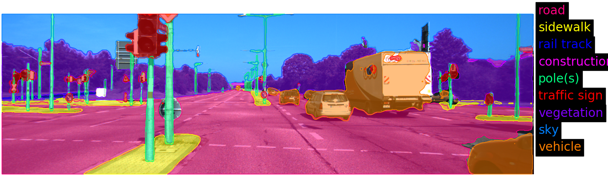
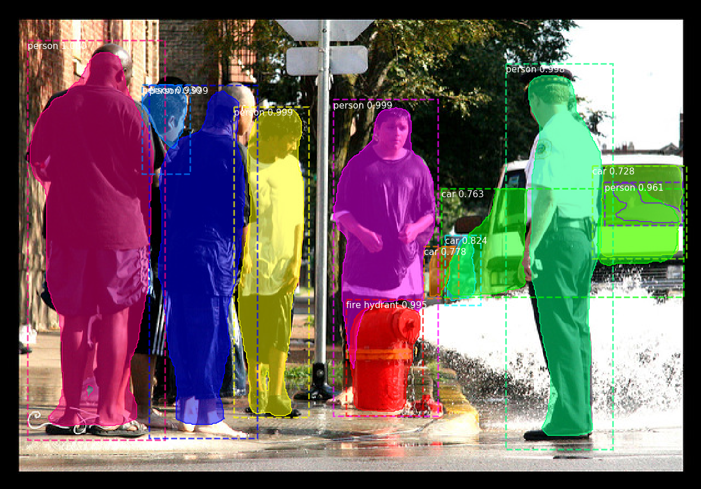

# image-segmentation

[](http://nearthlab.com/en/)

This repository includes:
  * A re-implementation of [matterport/Mask_RCNN](https://github.com/matterport/Mask_RCNN) with **multiple backbone support (with imagenet pretrained weights)** using the implementations of various backbone models in [qubvel/classification_models](https://github.com/qubvel/classification_models). (See [here](https://github.com/qubvel/classification_models#architectures) for available backbone architectures)
  * **Unified training, inference and evaluation** codes for Mask R-CNN and some semantic segmentation models (from [qubvel/segmentation_models](https://github.com/qubvel/segmentation_models)), for which you can **easily modify various parameters** with **simple configuration file interface**.
  * COCO dataset and KITTI dataset viewers
```
  [Available segmentation models]
  Instance:
    'maskrcnn'
  Semantic:
    'fpn', 'linknet', 'pspnet', 'unet'
  
  [Available backbone architectures]
  MobileNet:
    'mobilenetv2', 'mobilenet' 
  DenseNet:
    'densenet121', 'densenet169', 'densenet201'  
  ResNet:
    'resnet18', 'resnet34', 'resnet50', 'resnet101', 'resnet152'
  ResNext:
    'resnext50', 'resnext101'
  SE-Net:
    'seresnet18', 'seresnet34', 'seresnet50', 'seresnet101', 'seresnet152', 'seresnext50', 'seresnext101', 'senet154'
  Resnet V2:
    'resnet50v2', 'resnet101v2', 'resnet152v2'   
  Inception:
    'inceptionv3', 'inceptionresnetv2', 'xception'
  NASNet:
    'nasnetmobile', 'nasnetlarge'
  VGG:
    'vgg16', 'vgg19'
  
```


<br/>UNet with SE-ResNext101 backbone, trained on a synthetic dataset using this repository

<br/>FPN with ResNet18 backbone, trained on only 180 images using this repository

<br/>MaskRCNN with ResNet101 backbone, trained on COCO dataset, weights file ported from [matterport/Mask_RCNN](https://github.com/matterport/Mask_RCNN).
See [Custom Backbone](https://github.com/nearthlab/image-segmentation/tree/master/examples/custom_backbone) for more details. 

# Installation

**i. How to set up a virtual environment and install on it**<br/>
```bash
  sudo apt-get install virtualenv
  virtualenv -p python3 venv
  git clone https://github.com/nearthlab/image-segmentation
  cd image-segmentation
  source activate 
  cat requirements.txt | while read p; do pip install $p; done
```
  
  You should run the following commands every time you open a new terminal in order to run any of python files
```bash
  cd /path/to/image-segmentation
  source activate
  # the second line is equivalent to: 
  # source ../venv/bin/activate && export PYTHONPATH=`pwd`/image-segmentation
  # i.e. activating the virtual environment and add the image-segmentation/image-segmentation folder to the PYTHONPATH
```
  
**ii. How to install without a virtual environment**<br/>
  Note that working on a virtual environment is highly recommended. But if you insist on not using it, you can still do so:
```bash
  git clone https://github.com/nearthlab/image-segmentation
  cd image-segmentation
  cat requirements.txt | while read p; do pip install --user $p; done
```

* You may need to reinstall tensorflow(-gpu) if the automatically installed one is not suitable for your local environment.

**Requirements**<br/>

    1. Python 3.5+
    2. segmentation-models==0.2.0
    3. keras>=2.2.0
    4. keras-applications>=1.0.7 
    5. tensorflow(-gpu)=>1.8.0 (tested on 1.10.0)


# How to run examples
Please read the instruction written in READ.md files in each example folder
1. [Custom Backbone](https://github.com/nearthlab/image-segmentation/tree/master/examples/custom_backbone) <br/>
This example illustrates how to build MaskRCNN with your custom backbone architecture. In particular, I adopted [matterport's implementation of ResNet](https://github.com/matterport/Mask_RCNN/blob/1ad9feaae3d87b52495413e6c8ea0e92f0e5bc34/mrcnn/model.py#L171), which is slightly different from [qubvel's](https://github.com/qubvel/classification_models/blob/e223c492477030b80bdc56b53471df39c4e090ea/classification_models/resnet/builder.py#L24). Moreover, you can run the inference using the pretrained [MaskRCNN_coco.h5](https://github.com/nearthlab/image-segmentation/releases). (I slightly modified the 'mask_rcnn_coco.h5' in [matterport/Mask_RCNN/releases](https://github.com/matterport/Mask_RCNN/releases) to make this example work: the only differences are layer names)

2. [Imagenet Classification](https://github.com/nearthlab/image-segmentation/tree/master/examples/imagenet) <br/>
This example shows the imagenet classification results for various backbone architectures.

3. [Create KITTI Label](https://github.com/nearthlab/image-segmentation/tree/master/examples/create_kitti_label) <br/>
This example is a code that I used to simplify some of the object class labels in KITTI dataset. (For instance, I merged the 5 separate classes 'car', 'truck', 'bus', 'caravan' and 'trailer' into a single class called 'vehicle')

4. [Configurations](https://github.com/nearthlab/image-segmentation/tree/master/examples/configs) <br/>
Some example cfg files that describes the segmentation models and training processes

# How to train your own FPN / LinkNet / PSPNet / UNet model on KITTI dataset 

  i. Download the modified KITTI dataset from [release page](https://github.com/nearthlab/image-segmentation/releases)
  (or make your own dataset into the same format) and place it under [datasets](https://github.com/nearthlab/image-segmentation/tree/master/datasets) folder. 
  * KITTI dataset is a public dataset available [online](http://www.cvlibs.net/datasets/kitti/eval_semseg.php?benchmark=semantics2015).
  I simply splitted the dataset into training and validation sets and simplified the labels using [create_kitti_label.py](https://github.com/nearthlab/image-segmentation/blob/master/examples/create_kitti_label/create_kitti_label.py).
  
  * Note that this dataset is very small containing only 180 training images and 20 validation images. If you want to train a model for a serious purpose, you should consider using much more larger dataset.
  
  * To view the KITTI dataset, run:
  ```bash
    python kitti_viewer.py -d=datasets/KITTI
  ``` 

  ii. Choose your model and copy corresponding cfg files from examples/configs. For example, if you want to train a Unet model,
```bash
  cd /path/to/image-segmentation
  mkdir -p plans/unet
  cp examples/configs/unet/*.cfg plans/unet
```

  iii. [Optional] Tune some model and training parameters in the config files that you have just copied. Read the comments in the example config files for what each parameter means.
[Note that you have to declare a variable in .cfg file in the format
```{type}-{VARIABLE_NAME} = {value}```]

  iv. Run train.py:
```bash
  python train.py -s plans/unet -d datasets/KITTI \
  -m plans/unet/unet.cfg \
  -t plans/unet/train_unet_decoder.cfg plans/unet/train_unet_all.cfg
```
  This script will train the unet model in two stages with training information in plans/unet/train_unet_decoder.cfg followed by plans/unet/train_unet_all.cfg. The idea is:
  we first train the decoder part only while freezing the backbone with imagenet-pretrained weights loaded,
  and then fine tune the entire model in the second stage. You can provide as many training cfg files as you wish, dividing training into multiple stages.
  <br/><br/>
  Once the training is done, you can find the three files: 'class_names.json', 'infer.cfg' and 'best_model.h5',
  which you can use later for the [inference](https://github.com/nearthlab/image-segmentation/blob/master/README.md#how-to-visualize-inference)
  
  v. KITTI Evaluation:
```bash
  python evaluate_kitti.py -c /path/to/infer.cfg -w /path/to/best_model.h5 -l /path/to/class_names.json
```

# How to train your own MaskRCNN model on COCO dataset

  i. Download the COCO dataset. To do this, simply run:
```bash
  cd /path/to/image-segmentation/datasets
  ./download_coco.sh
```
  * To view the COCO dataset, run:
  ```bash
    python coco_viewer.py -d=datasets/coco
  ``` 
  
  ii. Copy the example cfg files from examples/configs/maskrcnn.
```bash
  cd /path/to/image-segmentation
  mkdir -p plans/maskrcnn
  cp examples/configs/maskrcnn/*.cfg plans/maskrcnn
```

  iii. [Optional] Tune some model and training parameters in the config files that you have just copied. Read the comments in the example config files for what each parameter means.
[Note that you have to declare a variable in .cfg file in the format
```{type}-{VARIABLE_NAME} = {value}```]


  iv. Run train.py:
```bash
  python train.py -s plans/maskrcnn -d datasets/coco \
  -m plans/maskrcnn/maskrcnn.cfg \
  -t plans/maskrcnn/train_maskrcnn_heads.cfg plans/maskrcnn/train_maskrcnn_stage3up.cfg plans/maskrcnn/train_maskrcnn_all.cfg
```

  This will train your MaskRCNN model in 3 stages (heads &rarr; stage3+ &rarr; all) as suggested in [matterport/Mask_RCNN](https://github.com/matterport/Mask_RCNN/blob/1ad9feaae3d87b52495413e6c8ea0e92f0e5bc34/samples/coco/coco.py#L498))
  Likewise, you can find the three files: 'class_names.json', 'infer.cfg' and 'best_model.h5',
  which you can use later for the [inference](https://github.com/nearthlab/image-segmentation/blob/master/README.md#how-to-visualize-inference)
  
  v. COCO Evaluation:
```bash
  python evaluate_coco.py -c /path/to/infer.cfg -w /path/to/best_model.h5 -l /path/to/class_names.json
```

# How to visualize inference

You can visualize your model's inference in a pop-up window:
```bash
python infer_gui.py -c=/path/to/infer.cfg -w=/path/to/best_model.h5 -l=/path/to/class_names.json \
-i=/path/to/a/directory/containing/image_files
```
or save the results as image files [This will create a directory named 'results' under the directory you provided in -i option, and write the viusalized inference images in it]:
```bash
python infer.py -c=/path/to/infer.cfg -w=/path/to/best_model.h5 -l=/path/to/class_names.json \
-i=/path/to/a/directory/containing/image_files
```
# References
```
@misc{matterport_maskrcnn_2017,
  title={Mask R-CNN for object detection and instance segmentation on Keras and TensorFlow},
  author={Waleed Abdulla},
  year={2017},
  publisher={Github},
  journal={GitHub repository},
  howpublished={\url{https://github.com/matterport/Mask_RCNN}},
}
```
